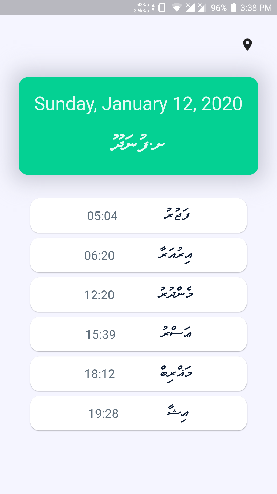
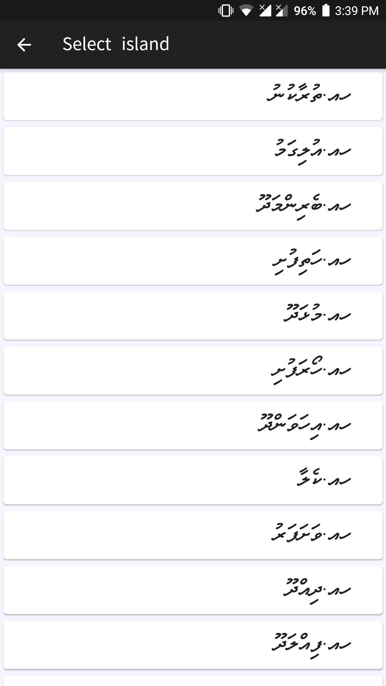

# Namaadhu app
An app to provide prayer times for the islands of the Maldives written in flutter. It uses db from salat mv app to get the prayer times

### The prayer times view


### The island select view



# Build 

```flutter build apk --release ```
pre built apks availabe [here]: https://github.com/Dharisd/namaadhuapp/releases


# Todo
* refactor code base
* fix scaling issues
* Add notification support
* change current open prayertime view when selected island changesinstead of opening new view

